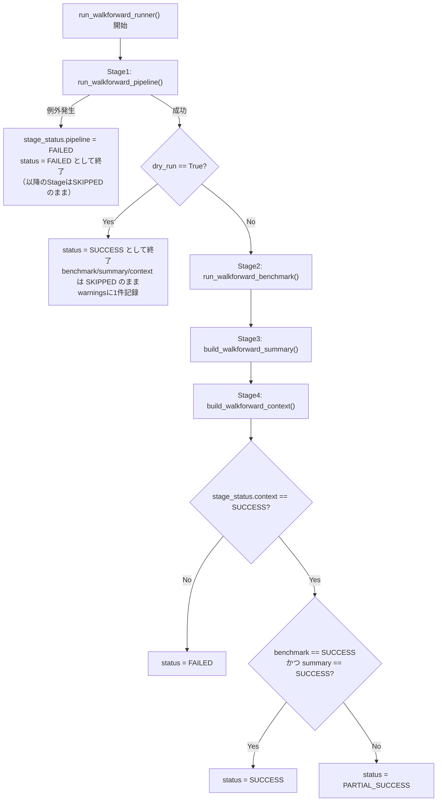

# Walk Forward 機能 開発者向け仕様書

本ドキュメントは `backtest/walkforward*.py` および `backtest/types.py` の**実装内容と一致することを確認した上で**作成した、開発者向けの技術仕様書です。利用者向けの操作マニュアルではありません。

対象ファイル:

- `backtest/walkforward.py`
- `backtest/walkforward_decision.py`
- `backtest/walkforward_evaluation.py`
- `backtest/walkforward_pipeline.py`
- `backtest/walkforward_benchmark.py`
- `backtest/walkforward_summary.py`
- `backtest/walkforward_context.py`
- `backtest/walkforward_runner.py`
- `backtest/types.py`

今後 v10 開発・AIコメント機能・ファンダメンタル分析・配当分析・SQLite保存・API化を行う際の基礎資料として利用することを想定しています。

---

## ① Walk Forward全体概要

### 目的

「未来データを見て最適化してしまっていないか（過剰適合していないか）」を確認するための、時系列検証（Walk Forward Validation）基盤です。Decision Engineが異なる期間・異なる市場環境でも同じ品質の判断を維持できているかを、既存の分析パイプライン（Rating・Confidence・Decision・Decision Report・Decision Validation・Benchmark・Summary）を再利用して検証します。

### 責務

Walk Forward一式は「新しい売買判定・スコア計算・統計計算を作ること」を一切行いません。すべて既存モジュール（`strategy_v8.py`/`strategy_v9.py`/`decision.py`/`decision_pipeline.py`/`decision_report.py`/`decision_validation.py`/`benchmark.py`）への**完全委譲**です。Walk Forward側が新たに行うのは、以下の2種類の処理のみです。

1. **期間の分割**（`walkforward.py`のみ）
2. **既存モジュールの戻り値を、次のモジュールが読める形へ整形して橋渡しする**（それ以外の全モジュール）

### 通常Backtestとの違い

通常の `backtest_runner.run_backtest()` は、対象期間全体を1つの連続した検証区間として評価します。Walk Forwardはこの結果を**複数のtrain/validation区間（Window）へ分割**し、Validation区間だけを抽出してDecision Engineを通すことで、「特定の期間だけに最適化された結果ではないか」を区間ごとに比較検証できるようにします。バックテスト自体の実行は`walkforward.py`が内部で`backtest_runner.run_backtest()`を1回呼び出すのみで、Windowごとに再度バックテストを実行し直すことはありません。

---

## ② モジュール構成

| モジュール | 役割 | 主な入力 | 主な出力 | 責務 |
|---|---|---|---|---|
| `walkforward.py` | 期間分割＋バックテスト結果の抽出 | `code`, `strategy_fn`, `strategy_name`, `period`, `splitter`, `date_col` | `WalkForwardValidationResult`（`windows`にWindowごとの`validation_records`） | `data_loader.fetch_stock_data()` + `backtest_runner.run_backtest()` を1回実行し、結果を`WindowSplitter`で期間分割してValidation区間のみを抽出する |
| `walkforward_decision.py` | Decision列の付与 | `walkforward.py`の戻り値 | `WalkForwardDecisionResult`（`windows`にWindowごとの`decision_records`） | 各Windowの`validation_records`へ`decision_pipeline.attach_decision_columns()`を適用する |
| `walkforward_evaluation.py` | Decision Validation / Decision Reportの適用 | `walkforward_decision.py`の戻り値 | `WalkForwardEvaluationResult`（`windows`にWindowごとの`decision_validation_result`/`decision_report_result`） | 各Windowの`decision_records`へ`decision_validation.build_decision_validation_summary()`と`decision_report.build_decision_report()`を適用する |
| `walkforward_pipeline.py` | 上記3モジュールの直列実行 | `code`, `strategy_fn`, `strategy_name`, `period`等 | `WalkForwardPipelineResult` | `walkforward.py` → `walkforward_decision.py` → `walkforward_evaluation.py` を順に呼び出すだけの配線 |
| `walkforward_benchmark.py` | 隣接Window間のBenchmark比較 | `walkforward_evaluation.py`相当の戻り値（`windows`配列を持つdict） | `WalkForwardBenchmarkResult` | window_index昇順で隣接する2つのWindowの`decision_report_result`を`benchmark.build_benchmark()`へ渡し、結果を集計する |
| `walkforward_summary.py` | Walk Forward全体の品質集計 | `walkforward_pipeline.py`の戻り値相当（`windows`層を持つdict） | `WalkForwardSummaryResult` | 各Windowの`decision_report_result`をWindow内・Window間で統計集計し、Health Check・Stability Score・Best/Worst Windowを算出する |
| `walkforward_context.py` | Pipeline/Benchmark/Summaryの統合 | `WalkForwardPipelineResult`, `WalkForwardBenchmarkResult`, `WalkForwardSummaryResult` | `WalkForwardContextResult` | 3つの戻り値を加工せずまとめ、メタ情報（`execution_metadata`等）を付与する |
| `walkforward_runner.py` | 最上位エントリポイント | `code`, `strategy_fn`, `strategy_name`等 | `WalkForwardRunnerResult` | `run_walkforward_pipeline()` → `run_walkforward_benchmark()` → `build_walkforward_summary()` → `build_walkforward_context()` を1回の呼び出しで順に実行する |
| `types.py` | 型定義の集約 | なし（型定義のみ） | なし | 上記モジュールが受け渡すJSON互換dictの構造を`TypedDict`として明文化する |

---

## ③ 実行フロー

`run_walkforward_runner()` の内部制御フローです（`backtest/walkforward_runner.py`の実装と一致）。

**重要**: Stage2（Benchmark）・Stage3（Summary）・Stage4（Context）は、それぞれ独立した`try`/`except`で保護されており、**前段のStageが失敗していても後続Stageの実行は試みられます**（Stage1のPipelineだけは失敗すると即座に全体を打ち切ります）。

---

## ④ 各戻り値の概要（主要キーのみ）

### Pipeline（`WalkForwardPipelineResult`）
`pipeline_version` / `run_id` / `strategy` / `code` / `period` / `generated_at` / `windows`（正常時は`WalkForwardEvaluationResult`相当のdict）/ `errors` / `warnings` / `extensions`（指定時のみ）

### Benchmark（`WalkForwardBenchmarkResult`）
`benchmark_schema_version` / `run_id` / `code` / `strategy_name` / `period` / `total_windows` / `total_transitions` / `windows`（各Windowに`benchmark_result`が付与される）/ `transitions` / `improvement_rank` / `best_transition` / `worst_transition` / `benchmark_summary` / `context` / `extensions`（いずれも指定時のみ）

### Summary（`WalkForwardSummaryResult`）
`summary_schema_version` / `metadata` / `health_check` / `stability_score` / `improvement_trend` / `benchmark_improvement_rate` / `metric_statistics` / `decision_distribution` / `best_window` / `worst_window` / `window_metrics` / `context` / `extensions`（いずれも指定時のみ）

### Context（`WalkForwardContextResult`）
`context_schema_version` / `execution_metadata` / `module_versions` / `data_availability` / `context_summary` / `navigation` / `pipeline`（Pipeline結果をそのまま保持）/ `benchmark`（同上）/ `summary`（同上）/ `context` / `extensions` / `ai_context` / `fundamental_context` / `dividend_context` / `market_context`（いずれも指定時のみ）

### Runner（`WalkForwardRunnerResult`）
`runner_schema_version` / `run_id` / `started_at` / `finished_at` / `elapsed_seconds` / `status`（`"SUCCESS"` / `"PARTIAL_SUCCESS"` / `"FAILED"`）/ `pipeline` / `benchmark` / `summary` / `context`（Stage4の実行結果。※詳細は⑦参照）/ `stage_status` / `stage_elapsed` / `errors` / `warnings` / `context_input`（指定時のみ。※詳細は⑦参照）/ `extensions` / `ai_context` / `fundamental_context` / `dividend_context` / `market_context`（いずれも指定時のみ）

---

## ⑤ エラー処理方針

Walk Forward一式のエラーは、**粒度の異なる3階層**で扱われています。

### 1. Window単位のエラー
`walkforward_decision.py`・`walkforward_evaluation.py`・`walkforward_benchmark.py`は、1つのWindow（または1つのWindow遷移）の処理中に例外が発生しても、その**Windowの`error`フィールドにのみ記録し、他のWindowの処理は継続**します。この種のエラーは上位（Pipeline/Runnerの`errors`）へは自動的に伝播しません。`windows[].error`を個別に確認する必要があります。

### 2. Pipeline全体のエラー
`walkforward_pipeline.py`は、3つの構成関数（`run_walkforward_validation()`・`run_walkforward_decision_validation()`・`run_walkforward_evaluation()`）**そのものが例外を送出した場合**（Window単位ではなく、関数呼び出し自体の失敗）のみ、`pipeline_result["errors"]`へ`{"stage": "walkforward"|"walkforward_decision"|"walkforward_evaluation", "message": ...}`として記録し、それ以降の構成ステップの呼び出しを打ち切ります。

### 3. Runner Stageのエラー
`walkforward_runner.py`は、Pipeline/Benchmark/Summary/Contextという4つの**Stage呼び出し単位**でエラーを扱います。各Stageの呼び出しが例外を送出すると、Runnerの`errors`へ`{"stage": "pipeline"|"benchmark"|"summary"|"context", "message": ...}`が追加され、`stage_status[該当Stage]`が`"FAILED"`になります。

**重要な注意点**: PipelineのStageが（例外を送出せず）成功していても、その内部（`pipeline_result["errors"]`）に上記②のエラーが記録されている場合、Runnerはそれを`errors`ではなく**`warnings`**へ`{"stage": "pipeline", "message": "内部Stage(...)でエラーが記録されています: ..."}`として転記します。Pipeline自体は「関数として正常に返ってきた」ため`stage_status["pipeline"] = "SUCCESS"`のままになる点に注意してください。

### `PARTIAL_SUCCESS` と `FAILED` の違い

最終的な`status`は以下のロジックで決まります（`run_walkforward_runner()`の最終status判定部分より）。

- `stage_status["pipeline"] != "SUCCESS"` → **`FAILED`**（以降のStageはすべてSKIPPEDのまま終了）
- `dry_run=True` かつ pipelineが成功 → **`SUCCESS`**（Benchmark/Summary/Contextは意図的なSKIPPED）
- `stage_status["context"] != "SUCCESS"` → **`FAILED`**
- `stage_status["context"] == "SUCCESS"` かつ `benchmark`・`summary`の両方が`"SUCCESS"` → **`SUCCESS`**
- `stage_status["context"] == "SUCCESS"` だが `benchmark`または`summary`のいずれかが`"SUCCESS"`でない → **`PARTIAL_SUCCESS`**

つまり「Contextまで到達できたか」が`FAILED`と`PARTIAL_SUCCESS`/`SUCCESS`の分かれ目であり、「BenchmarkとSummaryの両方が成功したか」が`SUCCESS`と`PARTIAL_SUCCESS`の分かれ目です。

---

## ⑥ Dry Run

`run_walkforward_runner(..., dry_run=True)` を指定した場合の挙動は以下の通りです。

- **Stage1（Pipeline）のみ実行**されます。
- Pipelineが成功すると、**Stage2（Benchmark）・Stage3（Summary）・Stage4（Context）は一切呼び出されません**（`run_walkforward_benchmark()`・`build_walkforward_summary()`・`build_walkforward_context()`はコールされない）。
- 戻り値の`benchmark`・`summary`・`context`はすべて`None`になります。
- `stage_status["benchmark"]` / `stage_status["summary"]` / `stage_status["context"]`はいずれも初期値の`"SKIPPED"`のままになります。
- `status`は`"SUCCESS"`になります（Benchmark以降が実行されないこと自体は失敗ではなく、意図した仕様として扱われます）。
- `warnings`に`{"stage": "runner", "message": "dry_run=True のため benchmark/summary/context はスキップされました。"}`が1件追加されます。

**注意**: 戻り値に`"dry_run"`という真偽値のキーは**存在しません**。Dry Runが実施されたかどうかを判定したい場合は、`stage_status["benchmark"] == "SKIPPED"`（または`benchmark is None`）を確認してください。

---

## ⑦ Contextについて（`context` と `context_input` の違い）

Walk Forward一式には「`context`」という語が**2つの異なる意味**で登場します。将来のAPI設計・SQLite保存スキーマ設計において混同すると事故の原因になるため、必ず区別してください。

### (A) 戻り値の `"context"` キー（Stage4の実行結果）

`run_walkforward_runner()`の戻り値`result["context"]`は、**Stage4（`walkforward_context.build_walkforward_context()`）が実際に返した結果**です。中身は`WalkForwardContextResult`（`context_schema_version`・`execution_metadata`・`module_versions`・`data_availability`・`context_summary`・`navigation`・`pipeline`・`benchmark`・`summary`等）です。

### (B) 引数の `context`（将来拡張用の予約入力）とその格納先 `"context_input"`

`run_walkforward_runner(..., context={...})`のように**呼び出し側が渡す`context`引数**は、将来の汎用追加コンテキスト（用途は現時点で未確定）を見据えた予約引数です。この値は以下のように扱われます。

- Benchmark・Summary・Context の各Stageへ**そのまま転送**されます（`run_walkforward_benchmark(..., context=context)`、`build_walkforward_summary(..., context=context)`、`build_walkforward_context(..., context=context)`）。
- Runnerの戻り値には、指定された場合のみ**`"context_input"`という別キー**として格納されます（`"context"`キーには格納されません。`"context"`キーは(A)のStage4結果で占有されているため）。

### まとめ

| キー | 意味 | 常に存在するか |
|---|---|---|
| `result["context"]` | Stage4（`build_walkforward_context()`）の実行結果 | 実行が到達すれば存在（Dry Run時・Pipeline失敗時は`None`） |
| `result["context_input"]` | Runner呼び出し時に渡した`context`引数の値（そのまま） | `context`引数が指定された場合のみ存在 |

---

## ⑧ 型定義（`backtest/types.py`）

### 役割

`walkforward.py`〜`walkforward_runner.py`が相互に受け渡しするJSON互換dictの構造を、`TypedDict`として1ファイルに集約しています。各`walkforward_*.py`モジュールは`backtest.types`を**import専用**で参照し、`types.py`側はどの`walkforward_*`モジュールもimportしません（型定義のみのリーフモジュールとすることで循環importを回避しています）。

### TypedDictが存在する理由

各モジュールの戻り値・引数はもともと`dict[str, Any]`として実装されていましたが、キー名・値の型を静的に確認できないため、mypy/Pylance等の型チェッカーによる恩恵（存在しないキーへのアクセス検出、型の不一致検出）が得られませんでした。実行時の構造・挙動を一切変えずに型ヒントだけを`TypedDict`へ差し替えることで、静的解析による安全性を向上させています。

### `Mapping[str, Any]` が残っている理由

以下の構造は、strategyの種類やDecisionラベルの種類によって**キー集合が実行時に変わる**ため、`TypedDict`では静的に表現できません。意図的に`Mapping[str, Any]`（または類似の型エイリアス）のまま残しています。

- `ValidationRecord` / `DecisionRecord`：`res_df`・`decision_pipeline.py`出力の1行分。列はstrategy_v8/v9/将来のv10で異なりうる。
- `DecisionReportResult` / `DecisionValidationResult`：`"report_info"`キー＋Decisionラベル（`"Strong Buy"`等）をキーとする構造。ラベルの種類・数は可変。
- `walkforward_pipeline.py`の`"windows"`キーの中身：正常時は`WalkForwardEvaluationResult`相当、途中失敗時は`{"windows": [...]}`という縮退構造になるため、単一の型で厳密に表現しきれない。

---

## ⑨ 将来拡張ポイント（予約引数）

以下の5つの予約引数は、`walkforward_pipeline.py`・`walkforward_benchmark.py`・`walkforward_summary.py`・`walkforward_context.py`・`walkforward_runner.py`のいずれかに**引数として存在しますが、現時点ではいずれも「受け取ってそのまま転送・格納するだけ」であり、内容を解釈・利用するロジックは一切実装されていません**。

| 予約引数 | 現在の転送先（Runner経由） | 想定用途 |
|---|---|---|
| `extensions` | Pipeline / Benchmark / Summary / Context の全Stage | 将来の追加拡張ステップ全般 |
| `context` | Benchmark / Summary / Context の各Stage（戻り値は`context_input`として格納。⑦参照） | 将来の汎用追加コンテキスト |
| `ai_context` | Context Stageのみ | 将来のAIコメント生成 |
| `fundamental_context` | Context Stageのみ | 将来のファンダメンタル評価 |
| `dividend_context` | Context Stageのみ | 将来の配当評価 |
| `market_context` | Context Stageのみ | 将来の市場環境評価 |

いずれも「未使用の予約フィールド」であることを明記します。これらを使った実際の分析・判定ロジックは、Walk Forward一式のいずれのモジュールにも存在しません。

---

## ⑩ 非責務（Walk Forwardでは行わないこと）

Walk Forward一式（`walkforward.py`〜`walkforward_runner.py`）は、以下を**一切行いません**。すべて他モジュールへの委譲、または未実装です。

- **Decision計算** … `decision.py`（`decision_pipeline.py`経由）へ完全委譲。
- **Rating計算** … `rating.py`（`decision_pipeline.py`経由）へ完全委譲。
- **Confidence計算** … `confidence.py`（`decision_pipeline.py`経由）へ完全委譲。
- **Benchmarkロジック**（改善率・重み・閾値の算出式） … `benchmark.py`（`walkforward_benchmark.py`は呼び出すだけ）。
- **Summaryロジック**（Health Check・Stability Scoreの算出式自体は`walkforward_summary.py`内にありますが、これは既存の集計値の統計処理であり、Decision/Rating/Confidence等の一次計算ではありません）。
- **UI描画** … `debug_ui.py`側の責務。Walk Forward一式のモジュールはStreamlit等のUIライブラリに一切依存しません。
- **SQLite保存** … 現時点で未実装。
- **API公開** … 現時点で未実装。

---

## ⑪ 開発ルール（今後の拡張時に守るべき原則）

### 新しいStageを追加する場合（例: Fundamental Stage）

1. 既存4Stage（Pipeline/Benchmark/Summary/Context）と同様、**新しいStageは既存の計算モジュールへ完全委譲**し、新しい計算ロジックをWalk Forward側に実装しない。
2. 新しいStageは**独立した`try`/`except`**で保護し、他のStageの成否に影響を与えない（`walkforward_runner.py`の既存4Stageと同じパターン）。
3. 追加するStageの戻り値は`backtest/types.py`へ新しい`TypedDict`として追加する。
4. Runnerの`stage_status`/`stage_elapsed`/`errors`/`warnings`の粒度に合わせ、新しいStage名を`_STAGE_NAMES`相当の一覧に追加する。

### 新しいContext（`fundamental_context`等）を実際に利用する場合

1. 現在は「素通しのみ」の予約フィールドだが、実際に中身を解釈する処理を追加する際も、**その解釈ロジックは`walkforward_context.py`や`walkforward_runner.py`ではなく、対応する専用モジュール（例: `fundamental.py`）に実装**し、Context層は「呼び出して結果を格納するだけ」の責務を維持する。
2. 既存のキー名・スキーマは変更せず、追加のみで対応する（後方互換性の維持）。

### 新しいSummary項目を追加する場合

1. `walkforward_summary.py`が既に確立している「Window内集約 → Window間集約」という2段階構造に従う。
2. 新しい統計値も「既存モジュールが返した値の集計」に限定し、新しい判定基準・スコア計算式を安易に追加しない（既存のBenchmark改善率・Stability Scoreと同様、値の出典を明記する）。

### 共通原則

- **JSON互換性を常に維持する**（`pandas.DataFrame`・`numpy`型・`pandas.Timestamp`を戻り値に含めない）。
- **既存のキー名・スキーマバージョンは変更しない**。構造を変える場合は対応する`*_schema_version`を更新する。
- **`schema_version`のインクリメントルールを明文化してから変更する**（本ドキュメント作成時点ではルールは未確定）。
- 各モジュールの責務（「計算」か「配線」か）を曖昧にしない。新しい計算式を追加する場合は、それが本当にWalk Forward層の責務か、既存の計算モジュール側に属すべきかを都度検討する。
